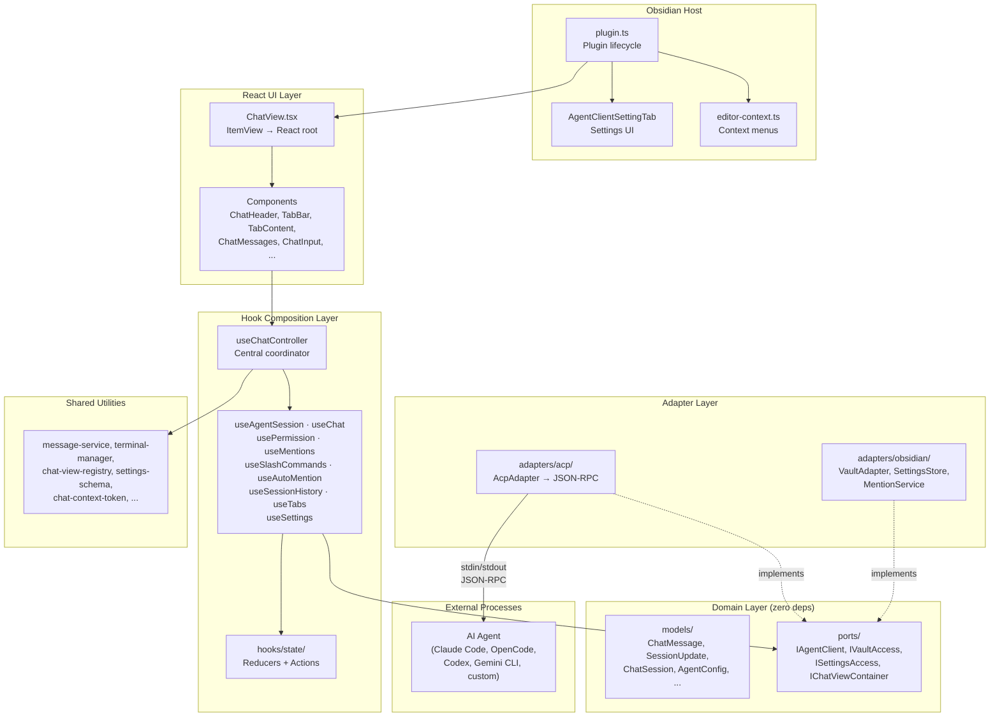
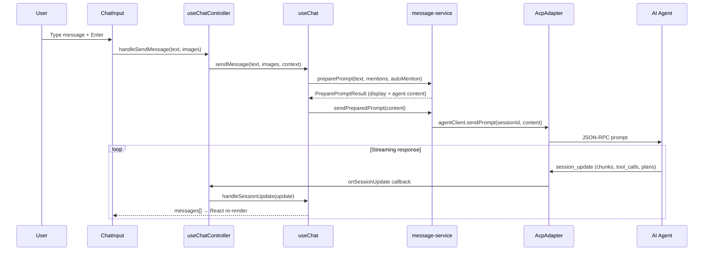
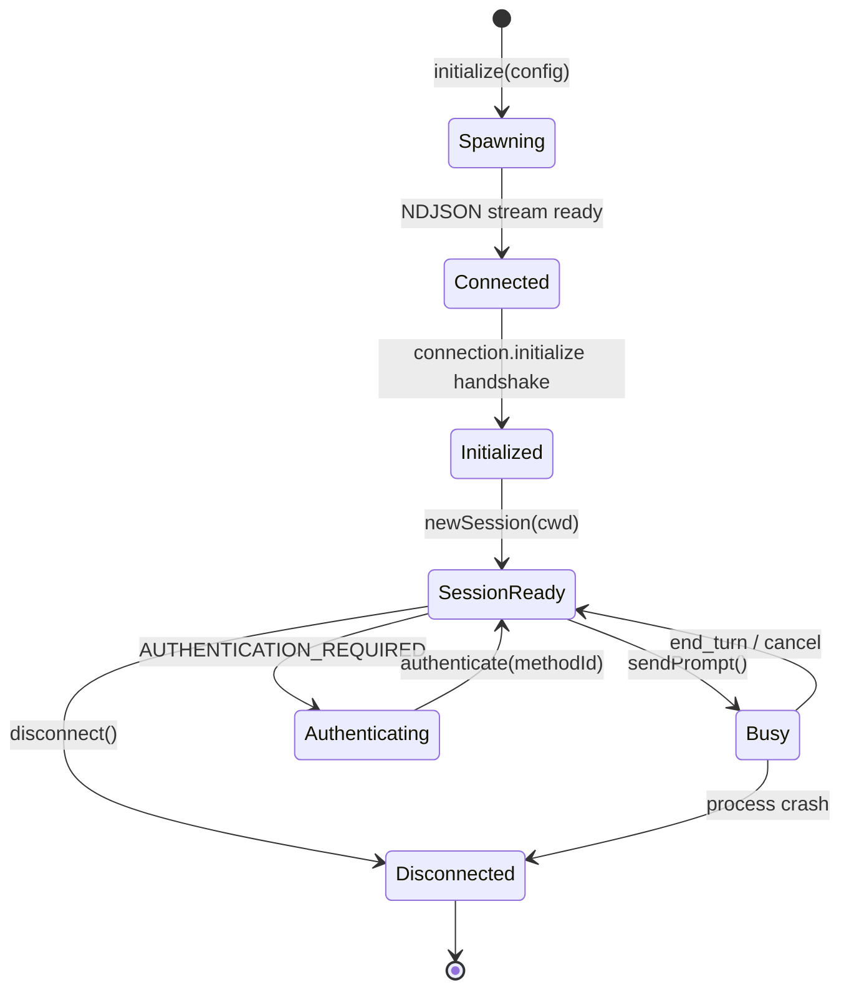
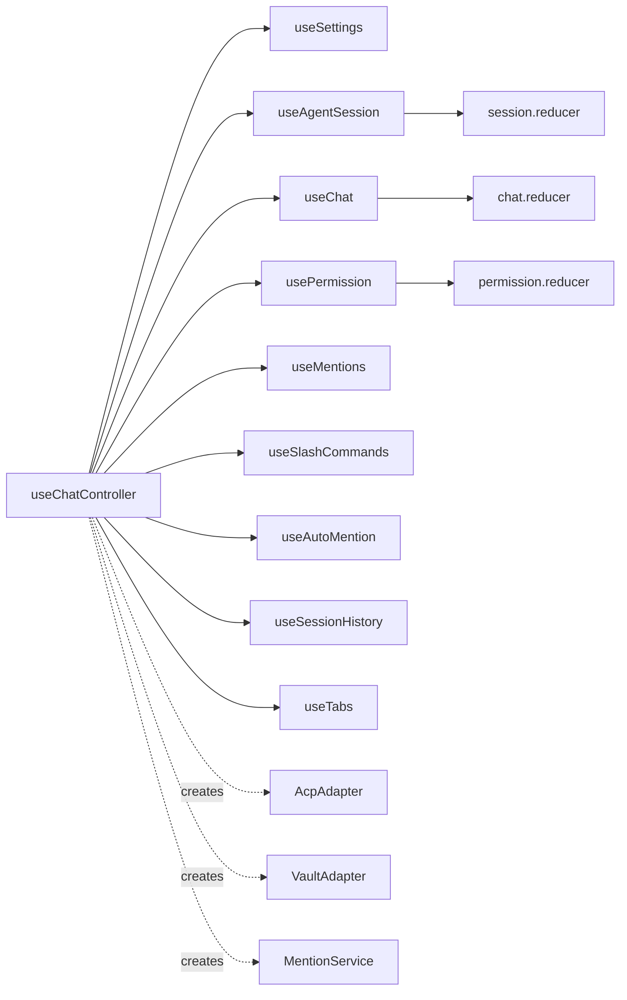
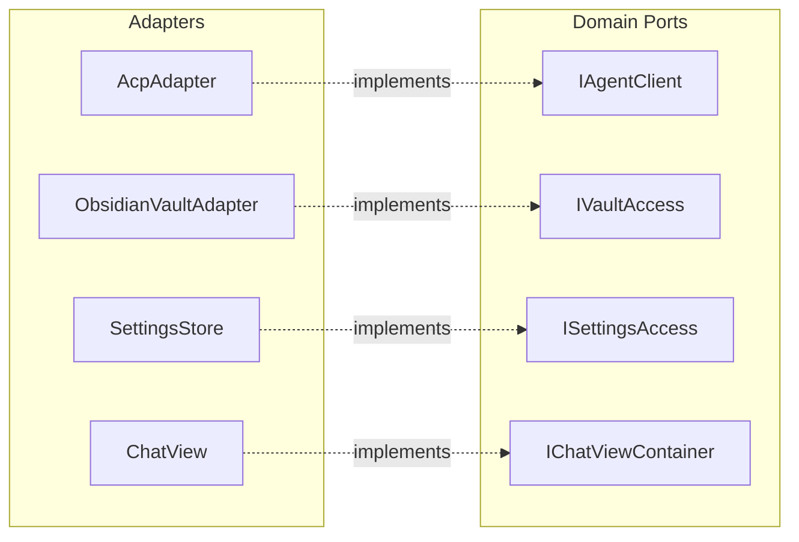

# Contributing to Obsius

Obsidian desktop plugin for AI chat with coding agents. React 19 + TypeScript, communicating via Agent Client Protocol (ACP) over JSON-RPC stdin/stdout.

## Quick Start

```bash
cd .obsidian/plugins/obsius
npm install
npm run dev          # Vite watch build → reload Obsidian to test
npm run lint         # Biome + ESLint + architecture guards
npm run test         # Vitest
npm run typecheck    # TypeScript only
```

## Architecture

### Layer Diagram



### Data Flow



### ACP Process Lifecycle



### Hook Composition



### Port / Adapter Mapping



## UI Layout

### Main Chat View

```
┌─────────────────────────────────────────────┐
│  ChatHeader                                 │
│  ┌─────────────────────────────────────────┐│
│  │ ▼ Claude Code          [+][⟳][📋][⚙]  ││
│  │  ┌───┬───┬───┐                         ││
│  │  │ 1 │ 2 │ 3 │  ← TabBar (max 4)      ││
│  │  └───┴───┴───┘                         ││
│  └─────────────────────────────────────────┘│
│                                             │
│  TabContent                                 │
│  ┌─────────────────────────────────────────┐│
│  │                                         ││
│  │  ┌─ user ──────────────────────────┐    ││
│  │  │ How do I refactor this module?  │    ││
│  │  └─────────────────────────────────┘    ││
│  │                                         ││
│  │  ┌─ assistant ─────────────────────┐    ││
│  │  │ I'll help you refactor. Let me  │    ││
│  │  │ start by reading the file...    │    ││
│  │  │                                 │    ││
│  │  │ ▶ Read src/module.ts    ✓       │    ││
│  │  │ ▶ Edit src/module.ts    ✓       │    ││
│  │  │   ┌─ diff ────────────────┐     │    ││
│  │  │   │ - old code            │     │    ││
│  │  │   │ + new code            │     │    ││
│  │  │   └───────────────────────┘     │    ││
│  │  │ ▶ Terminal: npm test     ⏳     │    ││
│  │  │   ┌─ output ─────────────┐     │    ││
│  │  │   │ PASS all tests       │     │    ││
│  │  │   └───────────────────────┘     │    ││
│  │  │                                 │    ││
│  │  │ ⚠ Allow edit to config.ts?     │    ││
│  │  │   [Allow once] [Always] [Deny]  │    ││
│  │  └─────────────────────────────────┘    ││
│  │                                         ││
│  │  ┌─ Thinking ──────────────────────┐    ││
│  │  │ ▶ Let me analyze the imports... │    ││
│  │  └─────────────────────────────────┘    ││
│  │                                    [↓]  ││
│  └─────────────────────────────────────────┘│
│                                             │
│  ChatInput                                  │
│  ┌─────────────────────────────────────────┐│
│  │ ┌─ ErrorOverlay (if error) ───────────┐ ││
│  │ │ ⚠ Connection failed — Retry?       │ ││
│  │ └────────────────────────────────────┘ ││
│  │                                         ││
│  │ ┌─ SuggestionDropdown ───────────────┐ ││
│  │ │  notes/architecture.md             │ ││
│  │ │  notes/api-design.md        ← @    │ ││
│  │ │  notes/todo.md                     │ ││
│  │ └───────────────────────────────────┘ ││
│  │                                         ││
│  │ ┌─ ContextBadgeStrip ───────────────┐  ││
│  │ │ 📄 module.ts:12-45  ✕  📝 auto ✕ │  ││
│  │ └──────────────────────────────────┘  ││
│  │                                         ││
│  │ ┌─ RichTextarea ────────────────────┐  ││
│  │ │ Refactor @[[notes/api]] to use... │  ││
│  │ └──────────────────────────────────┘  ││
│  │                                         ││
│  │ ┌─ ImagePreviewStrip ──────────────┐   ││
│  │ │ [🖼 img1.png ✕] [🖼 img2.png ✕] │   ││
│  │ └─────────────────────────────────┘   ││
│  │                                         ││
│  │ ┌─ InputActions ───────────────────┐   ││
│  │ │ [💬 Code] [🤖 claude-4]  [Send ▶]│   ││
│  │ └─────────────────────────────────┘   ││
│  └─────────────────────────────────────────┘│
└─────────────────────────────────────────────┘
```

### Session History Popover

```
┌─────────────────────────────────────────────┐
│  CONVERSATIONS                          [✕] │
│  ┌─────────────────────────────────────────┐│
│  │ 🔵 Refactor auth module          [⑂][🗑]││
│  │    2 min ago · Claude Code              ││
│  │─────────────────────────────────────────││
│  │ ⚪ Fix CSS layout bug             [⑂][🗑]││
│  │    1 hour ago · OpenCode                ││
│  │─────────────────────────────────────────││
│  │ ⚪ Add unit tests                 [⑂][🗑]││
│  │    yesterday · Codex                    ││
│  └─────────────────────────────────────────┘│
│  [Load more...]                             │
└─────────────────────────────────────────────┘
```

### Settings Tab

```
┌─────────────────────────────────────────────┐
│  Obsius Settings                            │
│                                             │
│  Default Agent: [▼ Claude Code           ]  │
│                                             │
│  ── Core ──────────────────────────────     │
│  Node.js Path:    [/usr/local/bin/node   ]  │
│  Send Shortcut:   [▼ Enter              ]   │
│  Max Note Length:  [10000                ]   │
│  Max Selection:    [10000                ]   │
│                                             │
│  ── Display ───────────────────────────     │
│  View Location:   [▼ Right sidebar tab  ]   │
│  Font Size:       [14                    ]  │
│  Completion Sound: [toggle]                 │
│  Diff Collapse:    [toggle]                 │
│                                             │
│  ── Agents ────────────────────────────     │
│  ▶ OpenCode   [command] [args] [env]        │
│  ▶ Claude     [command] [args] [API key]    │
│  ▶ Codex      [command] [args] [API key]    │
│  ▶ Gemini     [command] [args] [API key]    │
│                                             │
│  ── Custom Agents ─────────────────────     │
│  [+ Add Agent]                              │
│  ▶ My Agent   [command] [args] [env]        │
│                                             │
│  ── Developer ─────────────────────────     │
│  Debug Mode:   [toggle]                     │
└─────────────────────────────────────────────┘
```

## Key Concepts

### Agent Client Protocol (ACP)

ACP is a JSON-RPC protocol over stdin/stdout. Obsius spawns an agent process, establishes an NDJSON stream, performs a handshake (`initialize`), then creates sessions and exchanges prompts/responses.

Session updates stream back as typed events: message chunks, tool calls, plans, permission requests, mode/command updates.

### Hook Composition Pattern

All state and logic live in hooks, composed by `useChatController`. Components are pure renderers that receive props from the controller. No ViewModel or UseCase classes.

### Domain Zero-Dep Rule

The `domain/` layer contains only pure TypeScript types and interfaces. It never imports `obsidian`, `@agentclientprotocol/sdk`, or `react`. This keeps the domain stable across protocol and framework changes.

### Reducer-Backed State

State transitions in `useChat`, `useAgentSession`, and `usePermission` use typed reducers in `hooks/state/`. This ensures deterministic updates and makes state logic testable without React.

## Development Workflow

1. **Format**: `npm run format`
2. **Lint**: `npm run lint` (and `npm run lint:fix` if needed)
3. **Test**: `npm run test`
4. **Typecheck**: `npm run typecheck`
5. **Build**: `npm run build`

### Running Tests

```bash
npm run test                          # All tests
npm run test:coverage                 # With coverage gates
npx vitest run -t "should render"     # By test name
npx vitest run test/chat.reducer.test.ts  # By file
```

### Debugging

1. Enable **Debug Mode** in Obsius settings
2. Open DevTools (Ctrl+Shift+I / Cmd+Option+I)
3. Filter console by: `[AcpAdapter]`, `[useChat]`, `[NoteMentionService]`

## Code Style

| Rule | Value |
|------|-------|
| Indentation | Tabs, width 4 |
| Quotes | Double quotes |
| Trailing commas | Yes |
| Line endings | LF |
| Formatter | Biome (`npm run format`) |
| Linter | ESLint + Biome + architecture guards (`npm run lint`) |

## Adding Features

### New Hook
1. Create `src/hooks/useFeature.ts`
2. Wire into `useChatController.ts`
3. Access in components via controller return value

### New Component
1. Create `src/components/chat/MyComponent.tsx`
2. Accept props from `useChatController` return
3. Style in `styles.css`

### New Agent Type
1. Implement `IAgentClient` in `src/adapters/myagent/`
2. Domain port isolates the protocol

### New ACP Event
1. Add `SessionUpdate` variant in `domain/models/session-update.ts`
2. Map in `adapters/acp/update-routing.ts`
3. Handle in `useChat.handleSessionUpdate()`

## Project Structure

See [AGENTS.md](AGENTS.md) for the full directory tree and detailed architecture guide. Subdirectory guides:

- [`src/hooks/AGENTS.md`](src/hooks/AGENTS.md) — Hook composition, race conditions
- [`src/components/chat/AGENTS.md`](src/components/chat/AGENTS.md) — Component tree, rendering
- [`src/adapters/acp/AGENTS.md`](src/adapters/acp/AGENTS.md) — ACP protocol, process lifecycle
- [`src/shared/AGENTS.md`](src/shared/AGENTS.md) — Utility catalog
- [`src/domain/AGENTS.md`](src/domain/AGENTS.md) — Domain models, ports
