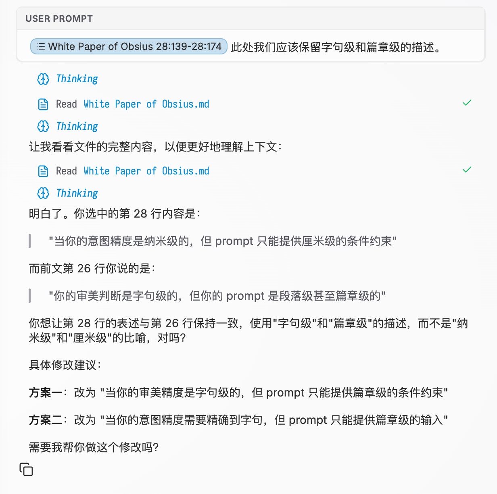
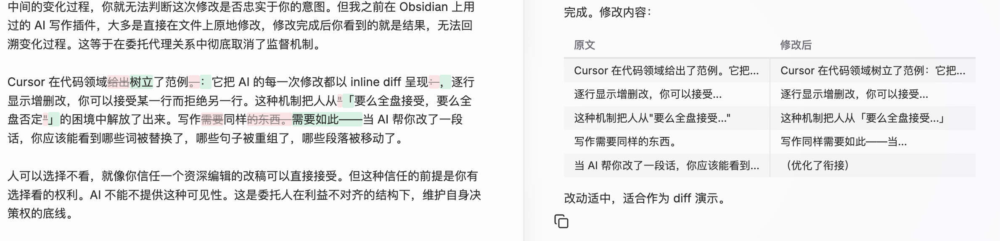
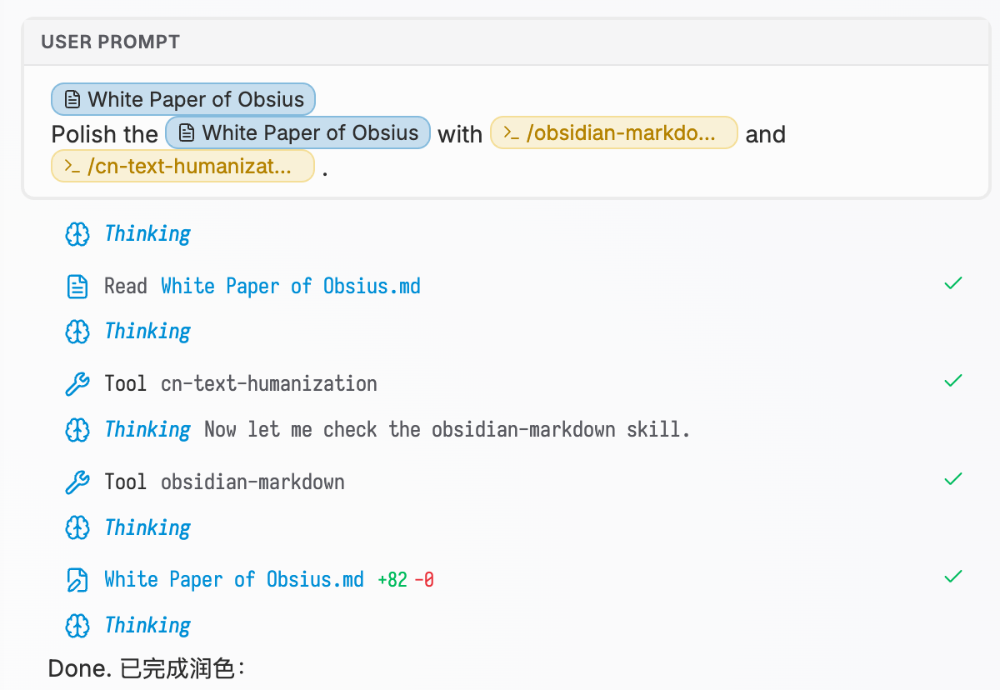

<h1>
	
	bsius — AI Agents in Obsidian
</h1>

Obsius rethinks how writers collaborate with AI. Instead of handing entire documents to a chatbot and hoping for the best, Obsius gives you precise, word-level control over every AI interaction. Select exactly what you want changed, see exactly what changed, and keep everything else untouched.

Read the design write-up: [WHITEPAPER.md](WHITEPAPER.md)

## Key Features

<strong>Word-and-Sentence-Level Context Control</strong>

Select precise text ranges for AI to modify; lock satisfied paragraphs from subsequent generations; define narrow edit boundaries so the action space stays constrained even with low-density prompts.

<strong>Inline Diff for Every Modification</strong>

Every AI edit is presented as a visible diff (inspired by Cursor's inline diffs). Accept or reject changes at the word/sentence level instead of "accept all or reject all."

<strong>Explicit Skills, Commands & MCP Triggers</strong>

Encapsulate reusable writing operations (style transfer, argument restructuring, summary extraction) as named, deterministic commands. Invoke them precisely instead of re-describing in natural language each time.

## Requirements

- Obsidian `1.11.5` or later
- Desktop only (not supported on mobile)

## Notice

- Tested only on macOS.
- I do not provide support for Windows/Linux, but it should work.
- Recommendation: For desktop users, [cc-switch](https://github.com/farion1231/cc-switch) makes it easier to customize and switch agent configurations.

Installation

You can install this plugin with [Obsidian42 - BRAT](https://github.com/TfTHacker/obsidian42-brat):

1. Install and enable `BRAT` in Obsidian.
2. Open BRAT settings and choose `Add Beta plugin`.
3. Paste this repository URL: `https://github.com/shuuul/obsius`
4. Install the plugin from BRAT and enable `Obsius`.

How Secure API Keys work

Built-in agent API keys (Claude, Codex, Gemini) are stored in Obsidian secure storage, not in this plugin's settings JSON.

### How to use

1. Open `Settings` -> `Community plugins` -> `Obsius`.
2. Go to each built-in agent section (`Claude Code`, `Codex`, `Gemini CLI`).
3. Enter a secret name in the `API key` field (for example, `obsius-claude-api-key`).
4. Save the secret value for that name using Obsidian's secret storage UI (Keychain).
5. Start a chat with that agent as usual.

### Notes

- Keys are stored via Obsidian's secure storage on desktop.
- Keys are device-local and are not synced through your vault files.
- If you use multiple devices, enter the key once on each device.

## Acknowledgments

- [obsidian-agent-client](https://github.com/RAIT-09/obsidian-agent-client) — Brilliant work that this project is forked from
- [Agent Client Protocol (ACP)](https://github.com/zed-industries/agent-client-protocol) — Built on by Zed
- [Notion](https://www.notion.so) — Design inspiration
- [Claudian](https://github.com/YishenTu/claudian) — Design inspiration
- [cursor.com](https://cursor.com) — Design inspiration
- [@lobehub/icons](https://github.com/lobehub/lobe-icons) — AI brand icons

## License

Apache License 2.0. This project is modified from [obsidian-agent-client](https://github.com/RAIT-09/obsidian-agent-client). See [LICENSE](LICENSE) for details.
